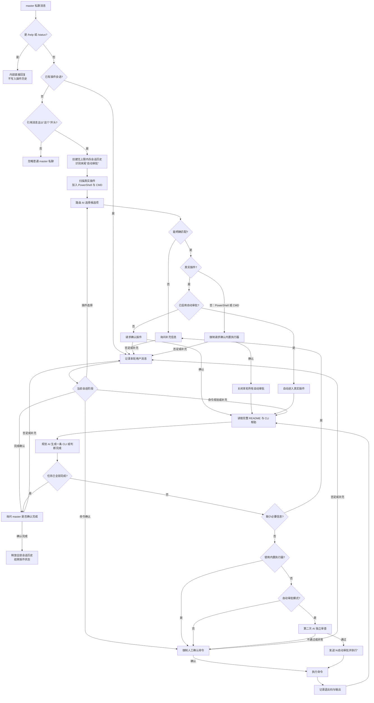

# QQ-AIreply

一个部署在 QQ 上的 AI 机器人。基于 [NapCat](https://github.com/NapNeko/NapCatQQ)（OneBot 11 实现）接入 QQ 消息，对接阿里云百炼（DashScope）OpenAI 兼容接口，实现群聊 / 私聊的智能问答。

## 功能特性

- **私聊问答**：任何人都可与机器人私聊（可在配置中关闭）
- **群聊问答**：默认需要被 `@` 才回复，也可配置触发关键词
- **群聊上下文**：按群隔离保存最近群消息、对机器人的 `@` 消息和机器人回复，并随请求一起交给 AI
- **可选图片历史**：可将群聊图片以 Base64 写入历史，并以多模态格式随上下文发送给 AI
- **回复上下文**：引用（回复）某条消息时，机器人会把被引用消息的原文一并带给 AI 理解
- **AI 输出日志**：所有模型回复按本地日期追加保存到 `logs/YYYY-MM-DD.log`，包括普通回复及插件路由、规划、审批结果
- **角色扮演**：通过提示词支持让机器人扮演任意角色
- **主人内部指令**：仅保留 `/help` 和 `/status`；其他功能统一由插件提供
- **AI 插件交互**：主人私聊引用消息并发送以“这个”开头的要求后，AI 根据各插件 README 简介选择插件，可经确认连续调用多条 CLI，直至主人确认整个任务完成

## 工作原理

```
QQ 客户端 ──> NapCat（注入 QQ 进程，解析事件）
                 │  正向 HTTP 上报（事件）
                 ▼
QQ-AIreply 机器人（本地 HTTP 上报服务，默认 8081 端口）
                 │  libcurl 调用
                 ▼
阿里云百炼（DashScope OpenAI 兼容 chat/completions）
                 │  回复文本
                 ▼
机器人经 NapCat HTTP API 发送群聊 / 私聊消息
```

## 目录结构

```
.
├── src/               # 机器人源码（C++17）
│   ├── main.cpp       # 主程序：事件分发、群聊/私聊逻辑、主人指令
│   ├── config.*       # config.json 解析
│   ├── ai_client.*    # 阿里云百炼 AI 接口客户端（libcurl）
│   ├── onebot_api.*   # OneBot 11 HTTP API 客户端
│   ├── http_server.*  # 本地 HTTP 上报服务（NapCat 事件推送入口）
│   ├── group_history.*# 按群隔离、JSON 持久化的滚动聊天历史
│   └── test_ai.cpp    # AI 接口独立测试程序
├── thirdparty/        # 第三方头文件（nlohmann/json）
├── logs/              # 按日期保存的 AI 原始输出（运行时创建，不入库）
├── config.json        # 运行配置（含密钥，已被 git 忽略，不入库）
├── config_example.json# 配置模板（占位符，克隆后复制为 config.json 填写）
├── CMakeLists.txt     # 构建脚本
├── start_bot.ps1      # 一键启动 NapCat + 机器人
└── NapCat.Shell/      # NapCat 运行目录（自行下载，不入库）
```

## 环境要求

- Windows + [MSYS2 MinGW64](https://www.msys2.org/)（含 gcc、cmake、libcurl）
- **NapCat（Shell 版）**：本项目在 **v4.18.19** 上测试通过，保证支持该版本；其他版本兼容性未知，建议使用相同版本。下载后解压到项目根目录下的 `NapCat.Shell/`
  - 下载链接：<https://github.com/NapNeko/NapCatQQ/releases/download/v4.18.19/NapCat.Shell.zip>
- **QQ 客户端**：NapCat 对各 QQ 客户端版本兼容性不同，需选择与所用 NapCat 匹配的 QQ 版本，可前往 <https://rodert.github.io/qq-versions/> 下载任意版本。本项目在 **9.9.30_260429**（Windows x64）上测试通过：
  - 下载链接：<https://github.com/Rodert/qq-versions/releases/download/qq-windows-x64-9.9.30-20260429/QQ_9.9.30_260429_x64_01.exe>
  - 安装后请将实际路径填入 `config.json` 的 `qq_path`（详见下文配置说明）
- 一个用于登录 NapCat 的 QQ 号作为机器人本体
- 阿里云百炼 API Key（[开通地址](https://bailian.console.aliyun.com/)）

## 快速开始

### 1. 配置

```powershell
# 复制配置模板并填写真实信息
Copy-Item config_example.json config.json
```

编辑 `config.json`（复制自 `config_example.json`），按下面的说明逐项填写。下面以 `config_example.json` 为准，解释每一个字段：

**顶层字段**

| 字段 | 说明 |
| --- | --- |
| `napcat_http_base` | NapCat 正向 HTTP 服务的地址，格式 `http://IP:端口`。默认 NapCat 端口为 3000，若在 WebUI 中改动过端口需同步修改 |
| `napcat_token` | NapCat HTTP API 的 `access_token`。需登录 NapCat WebUI（默认 `http://127.0.0.1:6099/webui`），在「网络配置」中查看或设置该 token，**必须与 NapCat 中配置的完全一致**；若 NapCat 未启用鉴权则留空 |
| `http_report_port` | 机器人本地 HTTP 上报服务的监听端口（默认 8081）。NapCat 会把消息事件推送至此，需与 NapCat WebUI 中配置的 HTTP 上报地址端口一致 |
| `bot_qq` | 机器人自己的 QQ 号（即登录 NapCat 的那个账号），用于判断群消息中是否 `@` 了机器人 |
| `bot_name` | 机器人显示名称。程序会用该值替换 `ai.system_prompt` 和 `ai.user_prompt` 中的 `<bot_name>`；示例配置仅保留占位值，不公开实际名称 |
| `master_qq` | 主人 QQ 号。主人私聊可使用内部指令（`/help` / `/status`）和插件交互，普通内容不会进入聊天 AI。**若留空则没有"主人"概念**：私聊内部指令和插件交互均不生效，所有用户的私聊消息（`private_chat_enabled=true` 时）都会交给 AI 回复 |
| `qq_path` | 本机 QQ 客户端的完整安装路径，**必须替换为你实际安装的位置**，例如 `C:\Program Files\Tencent\QQNT\QQ.exe`。`start_bot.ps1` 会用它启动 QQ |
| `private_chat_enabled` | 是否允许机器人回复**私聊**消息：`true` 回复所有人私聊；`false` 只处理主人指令，其他人私聊不回复 |
| `group_need_at` | 群聊中是否必须被 `@` 才回复：`true` 仅当被 `@`（或命中触发关键词）时回复；`false` 群里所有消息都会触发 |
| `group_trigger_keywords` | 群聊触发关键词数组。消息即使没被 `@`，只要包含其中任意关键词也会回复；`[]` 表示不启用关键词触发 |
| `group_history_limit` | 每个群保留并发送给 AI 的最近群聊文本条数，默认 `100`；设为 `0` 可关闭这部分历史 |
| `group_interaction_history_limit` | 每个群分别保留的“@ 机器人消息”和“机器人对此的成功回复”条数，默认各 `30`；设为 `0` 可关闭这部分历史 |
| `image_history_enabled` | 是否保存并发送群聊图片。`true` 时图片以 Base64 保存在历史 JSON，并作为多模态 `image_url` 内容发送给 AI；`false`（默认）时忽略图片段和纯图片消息。使用时需确保所选模型支持图片理解 |

**`ai` 对象字段（阿里云百炼配置）**

| 字段 | 说明 |
| --- | --- |
| `ai.api_key` | 阿里云百炼 API Key（百炼控制台创建），用于调用大模型接口，**含敏感信息请勿提交仓库** |
| `ai.base_url` | OpenAI 兼容接口地址，**须为完整的 `chat/completions` 端点**。公共地址如 `https://dashscope.aliyuncs.com/compatible-mode/v1/chat/completions`；也可在百炼控制台获取账号专属的工作空间地址 |
| `ai.model` | 使用的模型名，如 `qwen-max`、`qwen-plus` 等，需与 `base_url` 所在账号/工作空间支持的模型一致 |
| `ai.system_prompt` | 最高优先级的系统提示词，用于规定消息元数据、最终输出格式、真正 `@` 的标记格式和指令优先级 |
| `ai.user_prompt` | 用户提示词，用于定义机器人昵称、群聊人格、语气、角色扮演和一般行为偏好；程序会将其作为独立的 `user` 消息发送 |

`ai.system_prompt` 和 `ai.user_prompt` 均可使用 `<bot_name>` 变量；机器人启动时会将其替换为顶层 `bot_name` 的值。

**AI 响应解析说明**

本项目在阿里云百炼 OpenAI 兼容接口上测试，测试使用的模型为 **`qwen-max`**。程序按以下优先级解析返回的 JSON（见 `src/ai_client.cpp`）：

1. 含 `error` 字段 → 报错并放弃本次回复；
2. 含 `choices` 数组 → 取 `choices[0].message.content`（OpenAI 兼容标准格式）；
3. 含 `text` 字段 → 直接取文本（部分接口的简化格式）。

> 注意：以上仅覆盖已知返回结构。若更换其他平台/模型（如其他服务商的兼容接口、DashScope 原生接口等），其返回 JSON 结构可能不同，需要同步调整 `src/ai_client.cpp` 中的响应解析逻辑。

> 注意：`config.json` 含敏感信息已被 `.gitignore` 排除，切勿提交到仓库。

### 2. 构建

```powershell
cmake -S . -B build -G "MinGW Makefiles" -DCMAKE_BUILD_TYPE=Release
cmake --build build -j
```

> 若 libcurl / MinGW 不在默认位置，请按本机环境修改 `CMakeLists.txt` 顶部的 `MSYS2_PREFIX` 路径。

### 3. 在 NapCat 中配置上报

先用 `start_bot.ps1` 启动 NapCat 并扫码登录 QQ，然后打开 WebUI（默认 `http://127.0.0.1:6099/webui`），在「网络配置」中新增一个**正向 HTTP 服务**并设置**消息事件上报**：

- **正向 HTTP 服务**（机器人调用 NapCat API 发消息用）：
  - 监听地址：`0.0.0.0`，端口 `3000`（需与 `config.json` 的 `napcat_http_base` 一致）
  - `access_token`：此处设置/查看的 token 就是 `config.json` 的 `napcat_token`，**两边必须完全一致**（留空表示不鉴权，则 `napcat_token` 也留空）
- **HTTP 上报服务**（NapCat 推消息事件给机器人用）：
  - 上报地址：`http://127.0.0.1:8081/`（端口需与 `config.json` 的 `http_report_port` 一致）

### 4. 启动

```powershell
# 一键启动 NapCat + 机器人
powershell -ExecutionPolicy Bypass -File .\start_bot.ps1
```

NapCat Shell 在 Windows 上需要管理员权限。若当前终端未提权，启动脚本会自动重新请求管理员权限；请在系统 UAC 窗口中手动确认。

也可以手动分别运行：先启动 NapCat，再运行 `build\qq_ai_reply.exe`。

## 使用说明

- **群聊**：`@机器人 问题`（默认需要被 @；若关闭了 `group_need_at` 或消息含触发关键词则无需 @）
- **私聊**：直接发消息即可（`private_chat_enabled` 控制开关）
- **主人内部指令**（仅 `master_qq` 私聊有效，目前只保留两个）：
  - `/help` — 查看帮助并实时列出 `plugins/` 中当前可用的插件
  - `/status` — 查看运行状态
- **插件功能**：引用一条消息并发送以 `这个` 开头的内容即可启动；AI 先路由到插件或内置执行器，再按普通/自动审批模式规划和执行 CLI

插件目录按 `plugins/<插件ID>/` 组织。程序会自动扫描一级目录，从 README 的一级大标题读取名称，并把“大标题之后到下一个标题之前”的内容作为插件简介。选择插件时只向 AI 提供所有插件的名称和简介；进入所选插件后才读取其完整 README 和 CLI `--help`。真实插件的 CLI 参数以数组直接传入进程，不经过 shell，因此不需要为每个插件编写定制 C++ 代码。普通模式下每次执行前都会把完整命令发给主人确认；自动审批模式下则按下述规则复核。否定或其他回复会作为补充信息交给 AI 重新规划。

插件路由还包含两个写死的内置执行器：PowerShell 和 CMD。路由始终优先选择真实插件；只有用户明确要求执行系统命令且没有插件适合时才使用内置执行器。两者都适用时优先 PowerShell，CMD 仅用于明确依赖 CMD 或批处理语法的场景。选择任一内置执行器都必须由主人明确确认，即使本轮请求了自动审批也不会跳过；主人确认进入后，本轮自动审批会被关闭，后续每一条 PowerShell/CMD 命令都必须人工确认。PowerShell 参数被强制限定为 `-NoProfile -NonInteractive -Command <命令>`，CMD 参数被强制限定为 `/d /s /c <命令>`。

一次插件任务可以连续规划和执行多条 CLI 命令，但受运行机制限制，每轮只能规划并执行其中一条。需要先列举、搜索、读取状态或取得精确 ID 时，AI 会先执行这一条准备命令，再根据返回结果规划下一条；审批 AI 会按“是否为整个任务链中合理的当前步骤”判断，不会仅因一条安全的查询命令无法独自完成最终目标而拒绝。规划 AI 给出的操作说明会包含本步目的、与最终目标的关系、预期结果及其后续用途，并标明是只读准备步骤还是修改步骤；说明下方还会按照实际参数顺序逐项解释每个参数的作用和来源，这些解释也会交给审批 AI 核对。从最初的“这个”请求开始，主人和机器人的每一句对话都会保存在当前内存会话中，不设条数上限，并在每次规划时一并交给 AI。AI 判断全部目标已完成后会再向主人询问；只有主人明确确认完成，程序才会释放本轮全部会话历史并退出插件状态。未确认时，后续消息会继续作为补充要求处理。

若最初的“这个……”请求以 `自动审批` 结尾，本轮会启用自动审批模式。路由 AI 能明确匹配插件时会自动进入该插件；无法判断插件时才向主人询问。插件路由、规划和审批等结构化 AI 请求使用零温度以降低随机性。规划 AI 每返回一条 CLI 命令，程序会先检查逐项参数说明是否完整且与参数原值对应，再通过一个短上下文审查独立核对 ID、名称和内容值的映射，最后复核命令是否符合原始要求、README、CLI 帮助及安全约束。全部通过时机器人会发送“AI自动审批并执行”并立即执行；任一项未通过或审查失败时只把该条命令交给主人手动确认。无论是否启用自动审批，任务最终完成仍必须由主人确认后才会退出并释放历史。

### 插件调用逻辑



> **若 `master_qq` 留空**：机器人不再区分主人与普通用户——私聊内部指令和插件交互不生效，所有用户的私聊消息都会（在 `private_chat_enabled=true` 时）交给 AI 回复，相当于"来者不拒"模式。群聊行为不受 `master_qq` 影响。
- **回复上下文**：引用一条消息发送，机器人会结合被引用消息理解后回答
- **群聊历史**：历史按群号隔离并保存在 `userdata/group_history.json`，包含时间、发送者和文本，重启后自动恢复。每个数组超过配置上限时从头部丢弃最旧记录。机器人成功发送到群里的回复也会进入普通群聊历史，只有实际 `@` 机器人的消息及其回复会进入专门的交互历史
- **图片历史**：将 `image_history_enabled` 设为 `true` 后，群聊图片的 MIME 类型和 Base64 数据会保存在对应消息的 `images` 数组中，并随历史发送给 AI；关闭时不会读取、保存或发送图片，启动加载历史时也会清除已有的图片数据

## 隐私与安全

- API Key、Token、QQ 号等敏感信息仅存于本地 `config.json`，不入库
- AI 原始输出按本地日期保存在 `logs/`，可能包含对话和插件操作内容，整个目录已被 Git 忽略
- 群聊上下文保存在 `userdata/group_history.json`，NapCat 运行数据保存在 `NapCat.Shell/`，均不入库
- 请勿将本机器人用于任何违法或骚扰用途
